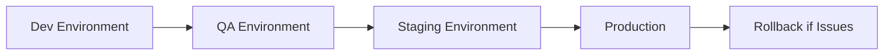
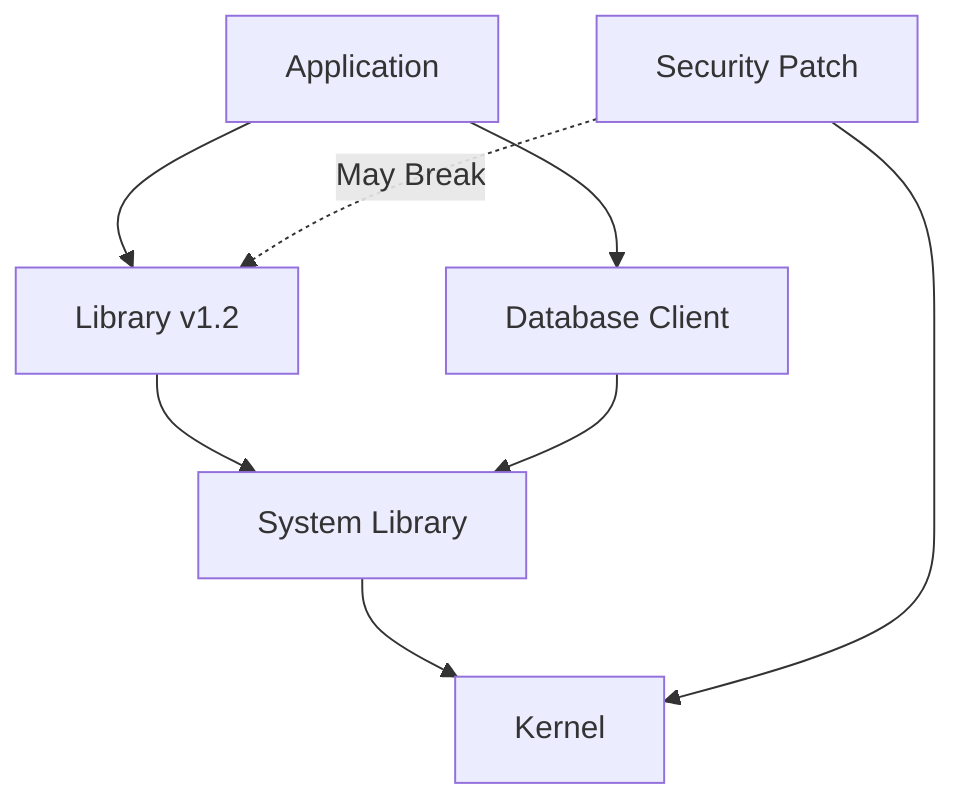
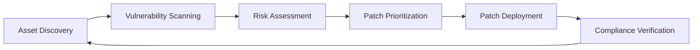

---
layout:
  width: default
  title:
    visible: true
  description:
    visible: false
  tableOfContents:
    visible: true
  outline:
    visible: true
  pagination:
    visible: true
  metadata:
    visible: true
---

# 📢 Security Unit 5 Discussion Post 2

## Security Unit 5 Discussion Post 2

Do a Google search for "patching enterprise Linux" and try to wade through all of the noise.

***

## 📚 Research References

1. https://developers.redhat.com/articles/2025/08/01/5-steps-consistently-patch-rhel-and-windows-systems
2. https://www.redhat.com/en/blog/best-practices-patch-management
3. https://www.redhat.com/en/blog/patch-systems-ansible-automation

***

## 1️⃣ <mark style="color:$danger;">What blogs (or AI) do I find that enumerates a list of steps or checklists to consider?</mark>


Recommended Resource

I found this one to be simple to understand as an overview:

https://developers.redhat.com/articles/2025/08/01/5-steps-consistently-patch-rhel-and-windows-systems


This article provides a clear, actionable framework for implementing consistent patch management across enterprise environments, covering both Red Hat Enterprise Linux and Windows systems.

***

## 2️⃣ <mark style="color:$danger;">How does patching a fleet of systems in the enterprise differ from pushing "update now" on your local desktop?</mark>


Critical Distinction

Enterprise patching is fundamentally different from desktop updates due to scale, complexity, risk management requirements, and the need for coordination across diverse systems and stakeholders.


### Desktop Patching vs. Enterprise Patching

| Aspect     | Desktop ("Update Now") | Enterprise Fleet                      |
| ---------- | ---------------------- | ------------------------------------- |
| Scale      | Single system          | Hundreds to thousands of systems      |
| Testing    | Optional/minimal       | Mandatory staging and validation      |
| Risk       | Personal inconvenience | Business-critical service disruption  |
| Automation | Manual/automatic       | Orchestrated automation required      |
| Rollback   | Reinstall if needed    | Coordinated rollback procedures       |
| Downtime   | Acceptable             | Requires maintenance windows          |
| Compliance | Not tracked            | Audit trails and compliance reporting |

***

## 🎯 Major Considerations



#### Scale and Diversity

The Challenge:

Enterprises manage hundreds to thousands of systems (physical, virtual, containers), requiring a coordinated inventory and patch visibility across platforms and locations.

Complexity Factors:

* Physical servers: Data centers across multiple locations
* Virtual machines: VMware, KVM, Hyper-V environments
* Containers: Docker, Podman, Kubernetes workloads
* Geographic distribution: Systems across regions and time zones
* Business units: Different departments with different requirements

Requirements:

* Complete asset inventory with patch status
* Visibility across all platforms and environments
* Centralized patch management tooling
* Coordination across distributed teams
* Multi-platform support (RHEL, Ubuntu, SLES, etc.)


```bash
# Query patch status across fleet
satellite-cli host list \
  --search "os = RHEL" \
  --fields "name,os,installable_errata" \
  | grep "security"

# Count systems needing critical patches
satellite-cli host list \
  --search "installable_errata_count > 0" \
  | wc -l
```




#### Testing and Staging

The Challenge:

Updates must be staged and rigorously tested for compatibility, especially with in-house applications and drivers, to avoid unpredictable downtime and system instability—a step rarely done on desktops.

Testing Workflow:



Testing Requirements:

| Environment | Purpose                    | Validation                                   |
| ----------- | -------------------------- | -------------------------------------------- |
| Development | Initial patch testing      | Basic functionality checks                   |
| QA          | Comprehensive testing      | Application compatibility, integration tests |
| Staging     | Production-like validation | Performance testing, full regression suite   |
| Production  | Phased rollout             | Canary deployments, gradual rollout          |

What Gets Tested:

* Application compatibility with patched libraries
* Custom kernel modules and drivers
* Database connectivity and performance
* Third-party integrations
* Monitoring and alerting systems
* Backup and recovery procedures


Real-World Impact

A single untested patch that breaks a critical application can cost millions in downtime and lost revenue. Testing is not optional in enterprise environments.




#### Risk-Based Prioritization

The Challenge:

Enterprises prioritize patches based on vulnerability severity (e.g., CVSS scores), business impact, and exploit activity, rather than applying all available updates universally.

Prioritization Framework:

| Priority Level | CVSS Score | Exploit Status          | Patch Timeline         |
| -------------- | ---------- | ----------------------- | ---------------------- |
| Critical       | 9.0-10.0   | Active exploitation     | 24-48 hours            |
| High           | 7.0-8.9    | Proof-of-concept exists | 7 days                 |
| Medium         | 4.0-6.9    | No known exploit        | 30 days                |
| Low            | 0.1-3.9    | Theoretical             | Next maintenance cycle |

Additional Risk Factors:

<details>

<summary>🔍 Risk Assessment Criteria</summary>

System Exposure:

* Internet-facing systems (highest priority)
* DMZ systems (high priority)
* Internal systems (medium priority)
* Air-gapped systems (lower priority)

Business Criticality:

* Revenue-generating systems
* Customer-facing applications
* Regulatory compliance systems
* Mission-critical infrastructure

Attack Surface:

* Number of exposed services
* Authentication mechanisms
* Network segmentation
* Data sensitivity

Exploit Availability:

* Public exploits available
* Weaponized in malware
* Active threat actor campaigns
* Metasploit modules exist

</details>


```bash
# Find critical CVEs on internet-facing systems
satellite-cli host list \
  --search "location = DMZ AND installable_errata_severity = critical" \
  --fields "name,installable_errata"

# Prioritize patches for production systems
satellite-cli host list \
  --search "lifecycle_environment = production" \
  --order "installable_errata_count DESC"
```



Zero-Day Response

When zero-day vulnerabilities are announced, enterprises must be able to patch thousands of systems within hours, not days. This requires pre-established procedures and automation.




#### Automation and Compliance

The Challenge:

Use of patch management tools (e.g., Satellite, Landscape, Tanium) for scheduling, deployment, rollback, and compliance tracking, rather than ad-hoc manual updates.

Enterprise Patch Management Tools:

| Tool               | Platform       | Key Features                               |
| ------------------ | -------------- | ------------------------------------------ |
| Red Hat Satellite  | RHEL           | Content management, lifecycle, compliance  |
| Ubuntu Landscape   | Ubuntu         | Fleet management, compliance reporting     |
| SUSE Manager       | SLES           | Patch management, configuration management |
| Ansible Automation | Multi-platform | Orchestration, playbook-driven patching    |
| Tanium             | Multi-platform | Real-time visibility, rapid deployment     |

Automation Capabilities:


```yaml
---
- name: Automated Patch Management
  hosts: production_servers
  serial: "20%"  # Patch 20% of fleet at a time
  
  tasks:
    - name: Take pre-patch snapshot
      command: /usr/local/bin/snapshot.sh create
      
    - name: Check for security updates
      dnf:
        name: "*"
        state: latest
        security: yes
      register: updates
      
    - name: Apply security patches
      dnf:
        name: "*"
        state: latest
        security: yes
      when: updates.changed
      
    - name: Reboot if kernel updated
      reboot:
        reboot_timeout: 600
      when: "'kernel' in updates.results"
      
    - name: Verify services after reboot
      systemd:
        name: "{{ item }}"
        state: started
      loop:
        - httpd
        - postgresql
        - redis
      
    - name: Report patching status
      uri:
        url: https://monitoring.example.com/api/patch-status
        method: POST
        body_format: json
        body:
          hostname: "{{ inventory_hostname }}"
          patches_applied: "{{ updates.results | length }}"
          reboot_required: "{{ 'kernel' in updates.results }}"
```


Compliance Tracking:

* Automated compliance reporting
* Audit trails for all patch activities
* Remediation tracking
* SLA monitoring
* Exception management
* Regulatory compliance (PCI-DSS, HIPAA, SOC 2)


Automation Benefits

Automated patch management reduces human error, ensures consistency, provides audit trails, and enables rapid response to critical vulnerabilities.




***

## 🚧 Major Roadblocks



#### Distro and Tools Fragmentation

The Challenge:

Multiple Linux distributions use different package managers and have varying update cadences, posing automation and policy challenges.

Distribution Diversity:

| Distribution         | Package Manager | Update Cycle                     | Enterprise Support  |
| -------------------- | --------------- | -------------------------------- | ------------------- |
| RHEL/Rocky/AlmaLinux | DNF/RPM         | Long-term (10 years)             | Vendor-supported    |
| Ubuntu               | APT/dpkg        | LTS: 5 years / Regular: 9 months | Canonical support   |
| SLES                 | Zypper/RPM      | Long-term (13+ years)            | SUSE support        |
| Debian               | APT/dpkg        | \~3-5 years                      | Community-supported |

Automation Challenges:


```yaml
---
- name: Multi-Distribution Patching
  hosts: all
  tasks:
    - name: Update RHEL/Rocky/Alma systems
      dnf:
        name: "*"
        state: latest
      when: ansible_os_family == "RedHat"
      
    - name: Update Ubuntu/Debian systems
      apt:
        update_cache: yes
        upgrade: dist
      when: ansible_os_family == "Debian"
      
    - name: Update SUSE systems
      zypper:
        name: "*"
        state: latest
      when: ansible_os_family == "Suse"
```


Policy Inconsistencies:

* Different repository structures
* Varying security advisory formats
* Inconsistent patch metadata
* Different rollback mechanisms
* Tool compatibility issues


Standardization Challenge

Many enterprises attempt to standardize on a single distribution to reduce complexity, but legacy systems and business unit autonomy often prevent complete standardization.




#### Dependency Chains and Rollbacks

The Challenge:

Complex inter-package dependencies can cause update failures or application incompatibilities, and rolling back (especially post-kernel patch) requires careful planning not needed on consumer desktops.

Dependency Complexity:



Common Dependency Issues:

| Issue                         | Impact             | Example                                         |
| ----------------------------- | ------------------ | ----------------------------------------------- |
| ABI breakage                  | Application crash  | glibc update breaks compiled binaries           |
| API changes                   | Functionality loss | Python library API change breaks scripts        |
| Kernel module incompatibility | Driver failure     | Third-party driver incompatible with new kernel |
| Configuration changes         | Service disruption | Config file format change requires migration    |

Rollback Complexity:


```bash
# Rolling back a kernel is straightforward
grub2-set-default "Previous Kernel"
reboot

# But rolling back libraries that were already used
# by running applications is complex:

# 1. Stop affected services
systemctl stop application

# 2. Downgrade package (may have dependency conflicts)
dnf downgrade glibc

# 3. Verify no other packages depend on newer version
dnf list installed | grep $(rpm -q glibc)

# 4. Restart services (may not start with old library)
systemctl start application

# 5. If still broken, restore from snapshot

# (This is why snapshots are critical)
```


Mitigation Strategies:

* Pre-patch system snapshots (LVM, Btrfs, VM snapshots)
* Comprehensive dependency testing in staging
* Phased rollouts with canary systems
* Documented rollback procedures
* Version pinning for critical packages


Kernel Patch Rollback

Kernel patches are particularly risky because they may affect:

* Device drivers
* Filesystem modules
* Network stack behavior
* Security modules (SELinux, AppArmor)

Always have a tested rollback plan before patching kernels in production.




#### Downtime and Uptime Constraints

The Challenge:

Many enterprise workloads are mission-critical—kernel and library updates often require scheduled maintenance windows or adoption of live-patching solutions, as opposed to "reboot and go" on a desktop.

Uptime Requirements:

| Service Tier          | Annual Downtime          | Maintenance Window        | Patching Strategy         |
| --------------------- | ------------------------ | ------------------------- | ------------------------- |
| Tier 1 (Critical)     | < 5.26 minutes (99.999%) | None available            | Live patching only        |
| Tier 2 (Important)    | < 52.6 minutes (99.99%)  | Quarterly, 4-hour windows | Minimal-downtime patching |
| Tier 3 (Standard)     | < 8.76 hours (99.9%)     | Monthly, 8-hour windows   | Standard patching         |
| Tier 4 (Low Priority) | < 43.8 hours (99.5%)     | Weekly, flexible windows  | Batch patching            |

Live Patching Solutions:

<details>

<summary>🔄 Live Patching Technologies</summary>

KernelCare (CloudLinux)

* Kernel patches applied without reboot
* Library patching support
* Commercial solution

Ksplice (Oracle)

* Kernel live patching
* Oracle Linux specific
* Commercial solution

kpatch (Red Hat)

* Open-source live kernel patching
* RHEL native support
* Requires infrastructure setup

KernelCare Enterprise

* Enterprise-grade kernel and user-space live patching
* Multi-distribution support
* Compliance reporting

Limitations:

* Not all patches can be applied live
* Major kernel updates still require reboot
* May need restart eventually (kernel version changes)
* Additional licensing costs

</details>


```yaml
# maintenance-schedule.yaml
---
maintenance_windows:
  production_web:
    day: Sunday
    time: "02:00-06:00 UTC"
    frequency: monthly
    max_downtime: 2 hours
    required_approvals:
      - platform_team
      - application_owner
      - change_advisory_board
    
  production_database:
    day: Saturday
    time: "01:00-05:00 UTC"
    frequency: quarterly
    max_downtime: 3 hours
    required_approvals:
      - dba_team
      - application_owner
      - cto
    pre_maintenance:
      - full_backup
      - snapshot_creation
      - failover_test
    
  development:
    day: Any
    time: "Business hours OK"
    frequency: weekly
    max_downtime: unlimited
```


Downtime Mitigation Strategies:

* Load balancer rotation (patch one node at a time)
* Blue-green deployments
* Canary releases
* Rolling updates across clusters
* Live patching for kernel/libraries
* Hot standby failover


Zero-Downtime Patching Pattern

For clustered applications:

1. Remove node from load balancer
2. Patch and reboot node
3. Verify node health
4. Return node to load balancer
5. Repeat for next node

This provides zero application downtime while maintaining patch compliance.




#### Visibility and Asset Management

The Challenge:

Lack of a complete asset and vulnerability inventory often means some systems are missed, creating weak points for attackers.

Visibility Gaps:

| Gap Type                 | Security Impact                             | Detection                        |
| ------------------------ | ------------------------------------------- | -------------------------------- |
| Shadow IT                | Unpatched systems outside policy            | Network scanning, CMDB audits    |
| Decommissioned Systems   | Forgotten running systems                   | Asset lifecycle tracking         |
| Ephemeral Infrastructure | Containers/VMs created and forgotten        | Cloud inventory automation       |
| Remote/Branch Systems    | Systems at edge locations                   | Centralized management required  |
| Third-Party Managed      | Vendor-managed systems unclear patch status | SLA enforcement, external audits |

Asset Discovery Methods:


```bash
# Network-based discovery
nmap -sV -O 10.0.0.0/8 --script=banner,ssh-hostkey

# Agent-based inventory
satellite-cli host list --fields "name,os,ip,last_checkin"

# Cloud inventory (AWS example)
aws ec2 describe-instances \
  --query 'Reservations[*].Instances[*].[InstanceId,State.Name,Tags[?Key==`Name`].Value|[0]]' \
  --output table

# Container inventory (Kubernetes)
kubectl get pods -A -o wide

# Configuration management database query
cmdb-cli query "SELECT hostname, os, patch_status, last_seen 
                FROM assets 
                WHERE last_seen < DATE_SUB(NOW(), INTERVAL 30 DAY)"
```


Vulnerability Management Integration:



Critical Visibility Requirements:

* Complete asset inventory (CMDB)
* Automated discovery and updates
* Vulnerability scanning integration
* Patch status tracking per asset
* Compliance dashboard and reporting
* Orphaned system detection
* Change detection and alerting


Security Blind Spot

A single unpatched, forgotten system can be the entry point for a major security breach. Asset visibility is not optional—it's the foundation of security patch management.


Asset Management Best Practices:

* Regular reconciliation of discovered assets vs. CMDB
* Automated decommissioning workflows
* Network access control (NAC) for unknown devices
* Cloud resource tagging and governance
* Container image scanning in registries
* Periodic external attack surface reviews



***

## 📝 Key Takeaways


Summary: Enterprise vs. Desktop Patching




### Major Considerations

* Scale and Diversity: Thousands of systems across platforms and locations
* Testing and Staging: Rigorous multi-environment validation required
* Risk-Based Prioritization: CVSS scores, business impact, exploit activity
* Automation and Compliance: Orchestrated tools with audit trails



### Major Roadblocks

* Distro and Tools Fragmentation: Multiple package managers and update cadences
* Dependency Chains: Complex dependencies and rollback challenges
* Downtime Constraints: Mission-critical systems require live patching or maintenance windows
* Visibility Gaps: Incomplete asset inventory creates security blind spots



### Enterprise Patching Requirements

* Inventory: Complete asset visibility
* Testing: Multi-stage validation environments
* Automation: Orchestration tools and playbooks
* Risk Management: Prioritization based on threat intelligence
* Compliance: Audit trails and regulatory reporting
* Business Continuity: Zero-downtime strategies for critical systems



***

## The Fundamental Difference

Desktop: "Click update now" → Individual inconvenience if something breaks

Enterprise: Coordinated orchestration → Business-critical impact if something breaks

***

## 🔗 Additional Resources

* https://developers.redhat.com/articles/2025/08/01/5-steps-consistently-patch-rhel-and-windows-systems
* https://www.redhat.com/en/blog/best-practices-patch-management
* https://www.redhat.com/en/blog/patch-systems-ansible-automation
