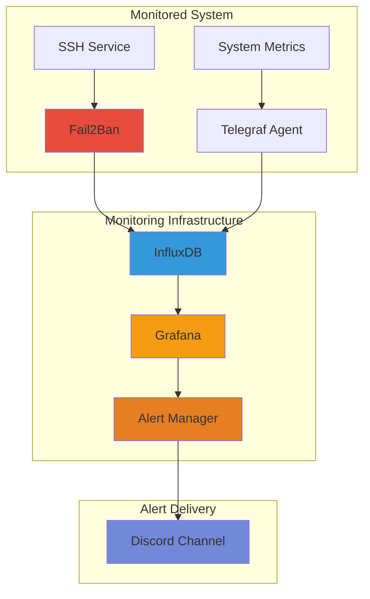

# session\_7\_monitoring\_alerting\_gitbook

We will focus on **building reliable monitoring infrastructure** and **implementing effective alerting strategies** that minimize noise while maximizing operational awareness.

This session explores how to design monitoring pipelines that provide actionable visibility into system health, performance, and security—enabling timely response to real issues without overwhelming operators with alert fatigue.

Monitoring and alerting form the backbone of incident detection and response. As environments scale and threats evolve, visibility into system activity becomes vital to maintaining security assurance and operational resilience.


**Enterprise Reality**: Monitoring everything generates massive data volumes and countless alerts that overwhelm teams.

> _Our job is to_ **design selective monitoring** _that captures what matters and_ **configure intelligent alerting** _that distinguishes signal from noise._


***

## 📚 Learning Objectives

By the end of Session 7, you will have foundational knowledge and skills in:



1. **Monitoring Architecture**: Understanding robust monitoring infrastructure design and data flow
2. **Data Types**: Working with logs, metrics, and traces for comprehensive system observability
3. **Alert Engineering**: Configuring alerts that are timely, actionable, and prioritized appropriately
4. **Tool Implementation**: Hands-on experience with Fail2Ban, Prometheus, and Grafana



5. **Pipeline Design**: Architecting monitoring pipelines that balance information flow with security
6. **Alert Moderation**: Implementing strategies to minimize alert fatigue and noise
7. **Indicators of Compromise**: Recognizing security events that require immediate attention
8. **Operational Awareness**: Making informed decisions about monitoring windows and severity levels



***

## 🎯 Relevance & Context

As your systems grow from a handful of servers to dozens or hundreds, manual monitoring becomes impossible. You need automated systems that watch for problems 24/7—but poorly configured monitoring creates its own problems through alert fatigue and data overload.

#### What You'll Learn

<details>

<summary>🔧 <strong>Technical Skills</strong></summary>

* [ ] How to architect monitoring pipelines with proper data collection and storage
* [ ] Understanding the "big four" metrics: compute, memory, disk, and network
* [ ] Implementing log aggregation and real-time log shipping from production systems
* [ ] Configuring Prometheus for metrics collection and time-series data storage
* [ ] Building Grafana dashboards that provide actionable visibility
* [ ] Setting up Fail2Ban for automated intrusion detection and response
* [ ] Creating alert rules with appropriate thresholds and severity levels

</details>

<details>

<summary>🎯 <strong>Professional Skills</strong></summary>

* [ ] Designing monitoring that captures indicators of compromise
* [ ] Balancing comprehensive observability with practical alert volume
* [ ] Understanding trade-offs between information flow and security boundaries
* [ ] Implementing alerting windows that match operational reality
* [ ] Configuring alert routing to appropriate teams and channels
* [ ] Preventing alert fatigue through intelligent threshold tuning
* [ ] Documenting monitoring architecture for security compliance requirements

</details>



**Why Intelligent Monitoring Matters**

**The Challenge**:

* Systems generate massive volumes of operational data continuously
* Complete visibility without filtering overwhelms security and operations teams
* Missing critical security events buried in noise leads to breaches
* Alert fatigue causes teams to ignore or disable monitoring entirely
* Logs trapped on compromised systems provide no forensic value

**The Solution**:

* **Selective monitoring** focuses on actionable metrics and security indicators
* **Real-time log shipping** ensures forensic data survives system compromise
* **Threshold-based alerting** distinguishes normal operations from problems
* **Alert moderation** respects operational windows and severity priorities
* **Centralized infrastructure** provides comprehensive visibility across all systems

**Real-World Application**: Think of airport security monitoring—cameras everywhere, but security personnel only get alerts for specific trigger events (weapons detected, restricted area breach, abandoned luggage). They don't watch every camera continuously or get alerts every time someone walks through a door.

_**Your monitoring should work the same way: comprehensive data collection, but intelligent filtering that surfaces only what requires human attention.**_




**What You're Building**:

A complete monitoring stack that collects metrics from production systems, stores them in time-series databases, visualizes them through dashboards, and sends intelligent alerts to Discord when thresholds are breached—all while implementing automated response through Fail2Ban.



**Important Context**:

The goal isn't monitoring everything—it's monitoring the _right things_ and alerting on _actionable events_. Over-monitoring creates as many problems as under-monitoring.



**Career Reality**:

You'll spend more time tuning alerts to reduce noise than you will configuring initial monitoring. The skill is in knowing what _not_ to alert on, understanding appropriate windows, and recognizing what truly requires immediate attention versus what can wait until business hours.




***

## 📊 Understanding Monitoring Data Types

Before building monitoring infrastructure, we need to understand the three fundamental types of observability data:



**Logs**: Immutable records of actions that occurred or were attempted in the system

**Key Characteristics**:

* Time-stamped event records with structured format (RFC standards)
* Contain: timestamp, hostname, process, severity, message
* Must be shipped off systems in real-time for security
* Never modify original log entries—transform copies if needed

**Why They Matter**: Logs provide the forensic record of _what happened_ on your systems. If a breach occurs and logs were only stored locally, you lose your investigation capability when the attacker wipes the compromised system.


**Critical Requirement**: Getting logs off servers in real time is one of the highest STIG requirements. If logs only exist on the system they're monitoring, they're useless when that system is compromised.




**Metrics**: Time-series numerical data representing system state and performance

**The "Big Four" (in priority order)**:

1. **Compute** (CPU utilization, load averages)
2. **Memory** (utilization, swap usage, cache pressure)
3. **Disk** (I/O operations, queue depth, latency)
4. **Network** (throughput, packet loss, connection states)

**USE Methodology** (for every resource):

* **Utilization**: Percentage capacity used (0-100%)
* **Saturation**: Work queued and waiting for resource
* **Errors**: Error rates, timeouts, failures

**Why They Matter**: Metrics tell you _how_ your systems are performing. Patterns in metrics reveal capacity issues before they become outages, and anomalies indicate security problems or misconfigurations.



**Traces**: Records showing how a single request flows through distributed systems

**Key Characteristics**:

* Follows one query/transaction across multiple services
* Shows timing at each checkpoint (span)
* Reveals bottlenecks and cascading failures
* Requires instrumentation at application level

**Example Flow**:

```
User Request → Load Balancer → Application Server → Database → Response
     [100ms]        [50ms]           [200ms]         [300ms]
```

**Why They Matter**: In complex environments with microservices, traces show you _where_ problems occur in the request path. Without traces, you only know "the application is slow"—you don't know if it's the database, network, or application code causing delays.



***

## 🏗️ Monitoring Architecture Components



#### Data Collection Layer

**Collection Methods**:

* **Agents**: Software running on monitored systems (Telegraf, Node Exporter)
* **Log Shippers**: Real-time log forwarding (rsyslog, Promtail, Filebeat)
* **Instrumentation**: Application-level metrics collection built into code

**Push vs. Pull**:

**Push Model** (systems send data out)

* ✅ Works through firewalls easily
* ✅ Real-time delivery as events occur
* ❌ Monitoring system must always be reachable
* Example: rsyslog forwarding logs

**Pull Model** (monitoring scrapes data)

* ✅ Monitoring controls data collection timing
* ✅ Systems don't need to know where monitoring lives
* ❌ Requires network access to each monitored system
* Example: Prometheus scraping exporters



#### Storage Layer

**Time-Series Databases** (for metrics):

* Store numerical data with timestamps
* Optimized for append and query patterns
* Examples: InfluxDB, Prometheus TSDB

**Log Aggregation Systems**:

* Centralized storage for all system logs
* Query languages for parsing: LogQL, Splunk SPL
* Examples: Loki, Elasticsearch, Splunk


**Storage Consideration**: Logs and metrics generate enormous data volumes. Plan for retention policies, compression, and eventually data aging/deletion to manage costs and performance.




#### Visualization Layer

**Dashboards** (Grafana, Kibana):

* Real-time visualization of metrics and logs
* Customizable views for different teams
* Historical data analysis and trending

**What to Dashboard**:

* System health indicators (CPU, memory, disk, network)
* Application-specific metrics (request rates, error rates, latency)
* Security indicators (failed logins, banned IPs, unusual patterns)
* Business metrics (active users, transaction volumes)



#### Alerting Layer

**Alert Manager** (or similar):

* Receives alert events from monitoring systems
* Routes alerts based on severity, source, time windows
* Handles alert grouping, deduplication, silencing
* Integrates with notification channels (Discord, Slack, PagerDuty, email)

**Alert Configuration**:

```yaml
# Example: Alert when system is under attack
- alert: HighFailedLoginRate
  expr: fail2ban_banned_ips > 5
  for: 5m
  annotations:
    summary: "Multiple IPs banned - possible coordinated attack"
    description: "{{ $value }} IPs banned in last 5 minutes"
```



***

## 🚨 Alert Engineering Fundamentals

Creating effective alerts requires balancing responsiveness with noise reduction:

### The "Boy Who Cried Wolf" Problem


**Alert Fatigue**: If your monitoring sends alerts constantly for non-actionable events, teams will:

1. Ignore alerts (missing real incidents)
2. Disable alerting (eliminating protection)
3. Experience burnout and turnover

**The goal is NOT alerting on everything—it's alerting on what actually requires human attention.**


### Alert Criteria Framework

<details>

<summary><strong>Timely</strong> - Alert arrives when action can still prevent or mitigate the problem</summary>

**Examples**:

* ✅ Disk 85% full → Time to add capacity before it fills
* ❌ Disk 99% full → Already causing application failures

**Timing Considerations**:

* How long until the problem becomes critical?
* Does the team have time to respond during business hours?
* Does this require immediate action or can it wait?

</details>

<details>

<summary><strong>Actionable</strong> - The alert recipient knows what to do about it</summary>

**Examples**:

* ✅ "Database replica lag exceeds 5 minutes" + documented runbook
* ❌ "Something is wrong" with no context or resolution steps

**Action Requirements**:

* Clear description of the problem
* Severity level indicating urgency
* Link to runbook or remediation procedures
* Context about what system/service is affected

</details>

<details>

<summary><strong>Relevant</strong> - The alert matters to the recipient and their responsibilities</summary>

**Examples**:

* ✅ Alert security team when suspicious login patterns detected
* ❌ Alert developers when load balancer has minor packet loss (ops team problem)

**Routing Considerations**:

* Who is responsible for this system/service?
* What team has the authority and capability to respond?
* Should different teams get different alerts based on role?

</details>

### Alert Severity Levels



**Critical**: System is down, data loss is occurring, or security breach is active

**Characteristics**:

* Immediate attention required 24/7
* Pages on-call personnel regardless of time
* Major impact to business operations or security

**Examples**:

* Primary database is unreachable
* Web application returning 500 errors to all users
* Active intrusion detected with data exfiltration
* Core service completely unavailable

**Response Time**: Minutes



**Warning**: System approaching problem state or minor issue exists

**Characteristics**:

* Attention required during business hours
* May escalate to critical if not addressed
* Degraded performance but service still functioning

**Examples**:

* Disk space 85% full (before it hits critical 95%)
* API response times elevated but within SLA
* Elevated but not catastrophic error rates
* Single replica in cluster unhealthy (redundancy still exists)

**Response Time**: Hours



**Info**: Informational events that may require monitoring but no immediate action

**Characteristics**:

* No immediate action required
* Useful for trending and analysis
* May indicate gradual degradation over time

**Examples**:

* Nightly backup completed successfully
* Routine maintenance window started
* Traffic patterns changed but within acceptable range
* Configuration change deployed

**Response Time**: Days or no action required



### Alert Window Configuration


**Operational Windows Matter**: A dev system being down at 2 AM Sunday is NOT the same severity as being down at 2 PM Wednesday.

Configure alert windows based on when the team works, when users are active, and when the system is actually supposed to be operational.


**Window Strategy Examples**:


```yaml
# Developer systems - only alert during work hours
dev_systems:
  critical_window: "Mon-Fri 09:00-18:00"
  warning_window: "Mon-Fri 08:00-20:00"
  timezone: "America/New_York"

# Production user-facing systems - always critical
production_web:
  critical_window: "24/7"
  warning_window: "24/7"

# Batch processing systems - only during run window
batch_jobs:
  critical_window: "Daily 01:00-06:00"
  warning_window: "Daily 00:00-08:00"
```


**Consider Multi-Region Operations**: If you have developers in Asia, Europe, and North America, your "business hours" windows need to reflect global operations—or you need region-specific alert routing.

***

## 🛠️ Lab Environment: Complete Monitoring Stack

You'll build a production-grade monitoring infrastructure using industry-standard tools:

### Architecture Overview



### Component Roles



**Fail2Ban**: Automated intrusion detection and response

**Function**:

* Monitors log files for failed authentication attempts
* Automatically bans IP addresses exceeding threshold
* Integrates with firewall to block malicious sources
* Exports metrics about banned IPs and jail status

**Why It Matters**: Prevents brute-force attacks automatically without manual intervention. Instead of waking you up at 3 AM because someone is trying passwords, Fail2Ban just blocks them.

**Configuration Highlights**:

```ini
[sshd]
enabled = true
port = ssh
filter = sshd
logpath = /var/log/auth.log
maxretry = 3
bantime = 600
```



**Telegraf**: Metrics collection agent

**Function**:

* Collects system metrics (CPU, memory, disk, network)
* Reads data from application outputs (like Fail2Ban status)
* Sends metrics to InfluxDB for storage
* Lightweight agent running on every monitored system

**Why It Matters**: Provides the "big four" infrastructure metrics that tell you if systems are healthy. Without these metrics, you're flying blind.

**Configuration Example**:

```toml
[[inputs.cpu]]
  percpu = true
  totalcpu = true
  collect_cpu_time = false

[[inputs.mem]]

[[inputs.disk]]
  ignore_fs = ["tmpfs", "devtmpfs"]

[[outputs.influxdb]]
  urls = ["http://localhost:8086"]
  database = "telegraf"
```



**InfluxDB**: Time-series database for metrics storage

**Function**:

* Stores numerical metrics with timestamps
* Optimized for high-write, time-based queries
* Handles data retention and downsampling
* Query language: InfluxQL or Flux

**Why It Matters**: You can't alert on data you don't store. InfluxDB keeps your metrics history so you can:

* Create dashboards showing trends over time
* Write queries that detect anomalies
* Set alert thresholds based on historical baselines

**Key Concepts**:

* **Measurement**: Like a table (e.g., "cpu", "memory")
* **Tags**: Indexed dimensions (e.g., host="server1")
* **Fields**: Actual metric values (e.g., usage\_idle=95.2)
* **Timestamp**: When the measurement occurred



**Grafana**: Visualization and alerting platform

**Function**:

* Creates dashboards showing metrics from InfluxDB
* Configures alert rules with thresholds
* Sends notifications to external systems
* Provides visual interface for all monitoring data

**Why It Matters**: Raw metrics in a database aren't useful. Grafana turns data into actionable insights through:

* Real-time dashboards showing system health
* Historical trending revealing capacity issues
* Visual alerts that stand out from normal patterns

**Alert Rule Example**:

```json
{
  "alert": "HighFailedLogins",
  "expr": "fail2ban_banned > 5",
  "for": "5m",
  "annotations": {
    "summary": "Multiple IPs banned - potential attack",
    "description": "{{ $value }} IPs banned in 5 minutes"
  }
}
```



### What You'll Accomplish

By the end of the lab, you will have:

✅ **Fail2Ban** monitoring SSH logs and auto-banning attackers\
✅ **Telegraf** collecting system metrics and Fail2Ban statistics\
✅ **InfluxDB** storing all time-series data\
✅ **Grafana** dashboard showing:

* System health metrics (CPU, memory, disk, network)
* Fail2Ban jail status (0 = no bans, 1 = IP banned)
* Real-time updates as bans occur\
  ✅ **Alert rule** configured to fire when thresholds breach\
  ✅ **Discord notification** receiving alerts with context

**Trigger Test**: You'll intentionally fail SSH authentication multiple times, watch Fail2Ban ban your IP, see the metric spike on the Grafana dashboard, and receive the alert in Discord—experiencing the complete monitoring and alerting pipeline in action.

***

## ✅ Prerequisites


**📋 Required Foundation**

To be successful in Session 7, you must know:

**Technical Skills**:

* **Directory Navigation**: Working with Linux filesystem structure and paths
* **Configuration Management**: Editing system configuration files
* **SystemD Services**: Managing services with `systemctl` commands
* **Basic Bash Scripting**: Understanding loops, conditionals, variables
* **Package Management**: Installing tools via system package manager

**Conceptual Foundation**:

* Understanding of client-server architecture and network communication
* Basic familiarity with SSH and authentication concepts
* Awareness of time-series data and metrics collection principles
* Recognition of what constitutes "normal" vs. "abnormal" system behavior

**Mindset Requirements**:

* Patience for configuration and troubleshooting integration between multiple tools
* Understanding that effective monitoring requires iteration and tuning
* Appreciation for balancing comprehensive visibility with practical alert volumes


***

## 🔑 Key Terms & Definitions

Understanding monitoring terminology is essential for effective implementation:

<details>

<summary><strong>Tracing &#x26; Spans</strong></summary>

**Tracing**: Following a single request/transaction through multiple systems\
**Span**: A single operation within a trace (e.g., database query duration)

**Example**: User loads webpage → \[Load Balancer: 50ms] → \[App Server: 200ms] → \[Database: 300ms] → \[Response: 50ms]

* Total trace shows 600ms request
* Each bracket is a span showing where time was spent

</details>

<details>

<summary><strong>Labels &#x26; Time Series</strong></summary>

**Label**: Dimensional metadata attached to metrics (e.g., `host="server1"`, `region="us-east"`)\
**Time Series**: Sequence of data points indexed by time

**Why Labels Matter**: They let you query and filter metrics. Instead of separate metrics for each server, you have one metric with different label values:

```
cpu_usage{host="server1"} = 75%
cpu_usage{host="server2"} = 45%
cpu_usage{host="server3"} = 90%
```

</details>

<details>

<summary><strong>Aggregation &#x26; Control Limits</strong></summary>

**Aggregation**: Combining multiple data points (sum, average, max, min)\
**Upper/Lower Control Limit (UCL/LCL)**: Statistical boundaries defining "normal" range

**Example**: Server CPU averages 40% with UCL at 80%

* CPU at 75% = Within normal range (warning threshold)
* CPU at 90% = Above UCL (critical threshold, trigger alert)

</details>

<details>

<summary><strong>SLO, SLA, SLI</strong></summary>

**SLI (Service Level Indicator)**: Quantifiable measure of service quality

* Example: "API response time under 200ms"

**SLO (Service Level Objective)**: Target value for an SLI

* Example: "99.9% of API requests respond within 200ms"

**SLA (Service Level Agreement)**: Contract with consequences if SLO isn't met

* Example: "If uptime falls below 99.9%, customer receives 10% credit"

**In Monitoring**: Your alerts should fire _before_ you violate SLOs, giving you time to fix issues before they breach SLAs.

</details>

<details>

<summary><strong>Push vs. Pull Data Collection</strong></summary>

**Push Model**: Monitored systems actively send data to monitoring infrastructure

* ✅ Real-time delivery as events occur
* ❌ Systems must know where to send data
* Example: rsyslog forwarding logs to central server

**Pull Model**: Monitoring infrastructure requests data from monitored systems

* ✅ Centralized control of collection timing and frequency
* ❌ Monitoring must have network access to each system
* Example: Prometheus scraping /metrics endpoints

</details>

<details>

<summary><strong>Alert Routing, Throttling, &#x26; Templates</strong></summary>

**Alert Routing**: Sending alerts to appropriate teams based on source, severity, or time\
**Throttling**: Rate-limiting alerts to prevent overwhelming notification channels\
**Alert Template**: Predefined message format with variables for context

**Example Template**:

```
ALERT: {{ $labels.severity }} - {{ $labels.alertname }}
Host: {{ $labels.instance }}
Value: {{ $value }}
Time: {{ $labels.timestamp }}
Runbook: {{ $labels.runbook_url }}
```

</details>

<details>

<summary><strong>Defensive Monitoring: SIEM, IDS, IPS</strong></summary>

**SIEM (Security Information and Event Management)**: Centralized system collecting and analyzing security logs from all sources

* Example: Splunk aggregating logs from firewalls, servers, applications

**IDS (Intrusion Detection System)**: Monitors network/system activity for malicious behavior and alerts

* Passive: Observes and reports but doesn't block

**IPS (Intrusion Prevention System)**: Actively blocks detected threats

* Active: Can drop packets, reset connections, block IPs

**Fail2Ban Role**: Acts as a lightweight IPS for authentication attacks—detects threats in logs and blocks them via firewall rules.

</details>

***

## 📚 Additional Resources & Deeper Challenges

<details>

<summary><strong>Recommended Reading &#x26; Documentation</strong></summary>

**Official Documentation**:

* [Prometheus Documentation](https://prometheus.io/docs/) - Metrics collection and alerting
* [Grafana Documentation](https://grafana.com/docs/) - Visualization and dashboards
* [InfluxDB Documentation](https://docs.influxdata.com/) - Time-series database
* [Fail2Ban Manual](https://www.fail2ban.org/) - Intrusion prevention

**Industry Resources**:

* Google SRE Book: "Monitoring Distributed Systems" chapter
* The USE Method (Brendan Gregg) for system performance analysis
* RFC 5424: Syslog Protocol specification
* NIST SP 800-92: Guide to Computer Security Log Management

</details>

<details>

<summary><strong>Advanced Lab Extensions</strong></summary>

**Level Up Your Monitoring Stack**:

1. **Add Node Exporter**
   * Install Prometheus Node Exporter for hardware/OS metrics
   * Create comprehensive system health dashboard
   * Configure alerts for disk space, memory pressure, CPU saturation
2. **Implement Log Aggregation**
   * Set up Promtail and Loki for centralized log collection
   * Query logs directly from Grafana
   * Correlate log events with metric anomalies
3. **Multi-System Monitoring**
   * Deploy monitoring to multiple servers
   * Use labels to distinguish between hosts/environments
   * Create aggregate dashboards showing cluster health
4. **Advanced Alerting**
   * Configure alert grouping to prevent notification storms
   * Implement alert silencing during maintenance windows
   * Set up escalation chains (warn → email, critical → page)
5. **Security-Focused Monitoring**
   * Monitor for privilege escalation attempts (sudo logs)
   * Track unusual network connections (netstat metrics)
   * Alert on file integrity changes in critical directories
   * Implement OSSEC or Wazuh for comprehensive HIDS

</details>

***

Page cover recommendation: Full-width hero image showing a network operations center (NOC) with multiple monitoring dashboards displaying real-time system metrics, creating immediate visual association with professional monitoring infrastructure.

Page icon recommendation: 📊 (Bar chart emoji for immediate recognition of monitoring/metrics focus)
